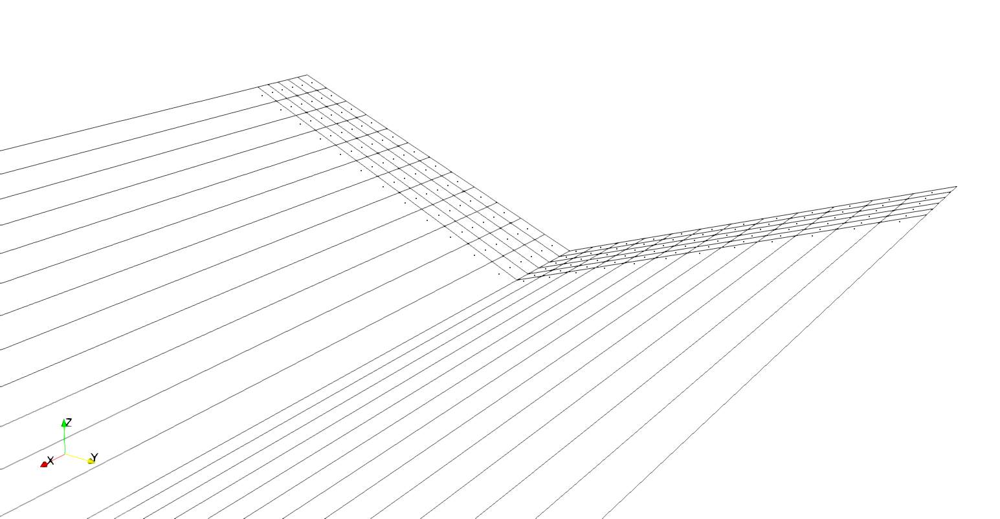

# Examples

These examples show how to use VortexLattice for various geometries, flow conditions, and analyses.  Many of these examples also provide a verification for the implementation of the vortex lattice method in this package.  

```@contents
Pages = ["examples.md"]
Depth = 3
```

```@setup examples
# this is placed here to pre-install matplotlib so the documentation doesn't get cluttered with the installation print statements.
using Plots
pyplot()
```

## Steady State Analysis of a Wing

This example shows how to calculate aerodynamic coefficients and stability derivatives for a symmetric planar wing.

```@example planar-wing
using VortexLattice

# geometry (right half of the wing)
xle = [0.0, 0.4]
yle = [0.0, 7.5]
zle = [0.0, 0.0]
chord = [2.2, 1.8]
theta = [2.0*pi/180, 2.0*pi/180]
phi = [0.0, 0.0]
fc = fill((xc) -> 0, 2) # camberline function for each section

# discretization parameters
ns = 12
nc = 6
spacing_s = Uniform()
spacing_c = Uniform()

# reference parameters
Sref = 30.0
cref = 2.0
bref = 15.0
rref = [0.50, 0.0, 0.0]
Vinf = 1.0
ref = Reference(Sref, cref, bref, rref, Vinf)

# freestream parameters
alpha = 1.0*pi/180
beta = 0.0
Omega = [0.0; 0.0; 0.0]
fs = Freestream(Vinf, alpha, beta, Omega)

# construct surface
grid, surface = wing_to_surface_panels(xle, yle, zle, chord, theta, phi, ns, nc;
    fc = fc, spacing_s=spacing_s, spacing_c=spacing_c)

# create vector containing all surfaces
surfaces = [surface]

# we can use symmetry since the geometry and flow conditions are symmetric about the X-Z axis
symmetric = true

# perform steady state analysis
system = steady_analysis(surfaces, ref, fs; symmetric=symmetric)

# retrieve near-field forces
CF, CM = body_forces(system; frame=Wind())

# perform far-field analysis
CDiff = far_field_drag(system)

CD, CY, CL = CF
Cl, Cm, Cn = CM

nothing #hide
```

The aerodynamic coefficients predicted by VortexLattice are nearly identical to those predicted by AVL.

```@example planar-wing
using PrettyTables #hide
using Markdown #hide

CD_avl = 0.00247 #hide
CL_avl = 0.24454 #hide
Cm_avl = -0.02091 #hide
CDiff_avl = 0.00248 #hide

table = [  #hide
"``C_L``" CL CL_avl CL-CL_avl;  #hide
"``C_{Di}`` (nearfield)" CD CD_avl CD-CD_avl;  #hide
"``C_{Di}`` (farfield)" CDiff CDiff_avl CDiff-CDiff_avl;  #hide
"``C_M``" Cm Cm_avl Cm-Cm_avl  #hide
]  #hide
header = ["Coefficient", "VortexLattice", "AVL", "Difference"]  #hide

str = pretty_table(String, table, header; #hide
    backend=:text, #hide
    tf = tf_markdown, #hide
    alignment=[:l, :r, :r, :r], #hide
    formatters = (ft_printf("%0.5f", [2,3]), ft_printf("%0.1e", 4))) #hide

Markdown.parse(str) #hide
```

We can also generate files to visualize the results in Paraview using the function `write_vtk`.

```julia
properties = get_surface_properties(system)

write_vtk("symmetric-planar-wing", surfaces, properties; symmetric)
```


For asymmetric flow conditions and/or to obtain accurate asymmetric stability derivatives we can use the keyword argument `mirror` when constructing the geometry to reflect the geometry across the X-Z plane prior to the analysis.  We also set the `symmetric` flag to `false` since we are no longer using symmetry in the analysis.

```@example planar-wing

# construct geometry with mirror image
grid, surface = wing_to_surface_panels(xle, yle, zle, chord, theta, phi, ns, nc;
    fc=fc, spacing_s=spacing_s, spacing_c=spacing_c, mirror=true)

# symmetry is not used in the analysis
symmetric = false

# create vector containing all surfaces
surfaces = [surface]

# perform steady state analysis
system = steady_analysis(surfaces, ref, fs; symmetric=symmetric)

# retrieve near-field forces
CF, CM = body_forces(system; frame=Wind())

# perform far-field analysis
CDiff = far_field_drag(system)

CD, CY, CL = CF
Cl, Cm, Cn = CM

nothing #hide
```

Once again, the aerodynamic coefficients predicted by VortexLattice are nearly identical to those predicted by AVL.

```@example planar-wing
using PrettyTables #hide
using Markdown #hide

CD_avl = 0.00247 #hide
CL_avl = 0.24454 #hide
Cm_avl = -0.02091 #hide
CDiff_avl = 0.00248 #hide

table = [ #hide
"``C_L``" CL CL_avl CL-CL_avl; #hide
"``C_{Di}`` (nearfield)" CD CD_avl CD-CD_avl; #hide
"``C_{Di}`` (farfield)" CDiff CDiff_avl CDiff-CDiff_avl; #hide
"``C_M``" Cm Cm_avl Cm-Cm_avl #hide
] #hide
header = ["Coefficient", "VortexLattice", "AVL", "Difference"] #hide

str = pretty_table(String, table, header; #hide
    backend=:text, #hide
    tf = tf_markdown, #hide
    alignment=[:l, :r, :r, :r], #hide
    formatters = (ft_printf("%0.5f", [2,3]), ft_printf("%0.1e", 4))) #hide

Markdown.parse(str) #hide
```

The stability derivatives are also very close to those predicted by AVL.

```@example planar-wing

dCF, dCM = stability_derivatives(system)

CDa, CYa, CLa = dCF.alpha
Cla, Cma, Cna = dCM.alpha
CDb, CYb, CLb = dCF.beta
Clb, Cmb, Cnb = dCM.beta
CDp, CYp, CLp = dCF.p
Clp, Cmp, Cnp = dCM.p
CDq, CYq, CLq = dCF.q
Clq, Cmq, Cnq = dCM.q
CDr, CYr, CLr = dCF.r
Clr, Cmr, Cnr = dCM.r

nothing #hide
```

```@example planar-wing
using PrettyTables #hide
using Markdown #hide

CLa_avl =   4.663214 #hide    
CLb_avl =   0.0 #hide
CYa_avl =   0.0     #hide
CYb_avl =  -0.000002 #hide
Cla_avl =   0.0     #hide
Clb_avl =  -0.025435 #hide
Cma_avl =  -0.397758     #hide
Cmb_avl =   0.0 #hide
Cna_avl =   0.0 #hide
Cnb_avl =   0.000452 #hide
CLp_avl =   0.0   #hide
CLq_avl =   5.649411    #hide
CLr_avl =   0.0 #hide
CYp_avl =   0.049063  #hide   
CYq_avl =   0.0     #hide
CYr_avl =  -0.000828 #hide
Clp_avl =  -0.524750     #hide
Clq_avl =   0.0   #hide
Clr_avl =   0.064456 #hide
Cmp_avl =   0.0    #hide
Cmq_avl =  -1.270212   #hide
Cmr_avl =   0.0 #hide
Cnp_avl =  -0.019175  #hide  
Cnq_avl =   0.0   #hide
Cnr_avl =  -0.000931 #hide

table = [ #hide
"``C_{La}``" CLa CLa_avl CLa-CLa_avl; #hide
"``C_{Lb}``" CLb CLb_avl CLb-CLb_avl; #hide
"``C_{Ya}``" CYa CYa_avl CYa-CYa_avl; #hide
"``C_{Yb}``" CYb CYb_avl CYb-CYb_avl; #hide
"``C_{la}``" Cla Cla_avl Cla-Cla_avl; #hide
"``C_{lb}``" Clb Clb_avl Clb-Clb_avl; #hide
"``C_{ma}``" Cma Cma_avl Cma-Cma_avl; #hide
"``C_{mb}``" Cmb Cmb_avl Cmb-Cmb_avl; #hide
"``C_{na}``" Cna Cna_avl Cna-Cna_avl; #hide
"``C_{nb}``" Cnb Cnb_avl Cnb-Cnb_avl; #hide
"``C_{Lp}``" CLp CLp_avl CLp-CLp_avl; #hide
"``C_{Lq}``" CLq CLq_avl CLq-CLq_avl; #hide
"``C_{Lr}``" CLr CLr_avl CLr-CLr_avl; #hide
"``C_{Yp}``" CYp CYp_avl CYp-CYp_avl; #hide
"``C_{Yq}``" CYq CYq_avl CYq-CYq_avl; #hide
"``C_{Yr}``" CYr CYr_avl CYr-CYr_avl; #hide
"``C_{lp}``" Clp Clp_avl Clp-Clp_avl; #hide
"``C_{lq}``" Clq Clq_avl Clq-Clq_avl; #hide
"``C_{lr}``" Clr Clr_avl Clr-Clr_avl; #hide
"``C_{mp}``" Cmp Cmp_avl Cmp-Cmp_avl; #hide
"``C_{mq}``" Cmq Cmq_avl Cmq-Cmq_avl; #hide
"``C_{mr}``" Cmr Cmr_avl Cmr-Cmr_avl; #hide
"``C_{np}``" Cnp Cnp_avl Cnp-Cnp_avl; #hide
"``C_{nq}``" Cnq Cnq_avl Cnq-Cnq_avl; #hide
"``C_{nr}``" Cnr Cnr_avl Cnr-Cnr_avl; #hide
] #hide
header = ["Coefficient", "VortexLattice", "AVL", "Difference"] #hide

str = pretty_table(String, table, header; #hide
    backend=:text, #hide
    tf = tf_markdown, #hide
    alignment=[:l, :r, :r, :r], #hide
    formatters = (ft_printf("%0.5f", [2,3]), ft_printf("%0.1e", 4))) #hide

Markdown.parse(str) #hide
```

Visualizing the geometry now shows the circulation distribution across the entire wing.

```julia
properties = get_surface_properties(system)

write_vtk("mirrored-planar-wing", surfaces, properties; symmetric)
```


## Steady State Analysis of a Flat Plate Wing with Dihedral

This example shows how to calculate aerodynamic coefficients and stability derivatives for a simple wing with dihedral.

```@example wing-with-dihedral
using VortexLattice

xle = [0.0, 0.4]
yle = [0.0, 7.5]
zle = [0.0, 3.0]
chord = [2.2, 1.8]
theta = [2.0*pi/180, 2.0*pi/180]
phi = [0.0, 0.0]
fc = fill((xc) -> 0, 2) #camberline function for each section

ns = 12
nc = 6
spacing_s = Uniform()
spacing_c = Uniform()
mirror = false
symmetric = true

Sref = 30.0
cref = 2.0
bref = 15.0
rref = [0.50, 0.0, 0.0]
Vinf = 1.0
ref = Reference(Sref, cref, bref, rref, Vinf)

alpha = 1.0*pi/180
beta = 0.0
Omega = [0.0; 0.0; 0.0]
fs = Freestream(Vinf, alpha, beta, Omega)

# declare symmetry
symmetric = true

# construct surface
grid, surface = wing_to_surface_panels(xle, yle, zle, chord, theta, phi, ns, nc;
    fc = fc, spacing_s=spacing_s, spacing_c=spacing_c)

# create vector containing all surfaces
surfaces = [surface]

# perform steady state analysis
system = steady_analysis(surfaces, ref, fs; symmetric=symmetric)

# retrieve near-field forces
CF, CM = body_forces(system; frame=Wind())

# perform far-field analysis
CDiff = far_field_drag(system)

CD, CY, CL = CF
Cl, Cm, Cn = CM

nothing #hide
```

The results predicted by VortexLattice are close to those predicted by AVL, with the difference primarily explained by the manner in which the normal vector is defined in VortexLattice and AVL, respectively.

```@example wing-with-dihedral
using PrettyTables #hide
using Markdown #hide

CD_avl = 0.00248 #hide
CL_avl = 0.24808 #hide
Cm_avl = -0.02250 #hide
CDiff_avl = 0.0024671 #hide

table = [ #hide
"``C_L``" CL CL_avl CL-CL_avl; #hide
"``C_{Di}`` (nearfield)" CD CD_avl CD-CD_avl; #hide
"``C_{Di}`` (farfield)" CDiff CDiff_avl CDiff-CDiff_avl; #hide
"``C_M``" Cm Cm_avl Cm-Cm_avl #hide
]
header = ["Coefficient", "VortexLattice", "AVL", "Difference"] #hide

str = pretty_table(String, table, header; #hide
    backend=:text, #hide
    tf = tf_markdown, #hide
    alignment=[:l, :r, :r, :r], #hide
    formatters = (ft_printf("%0.5f", [2,3]), ft_printf("%0.1e", 4))) #hide

Markdown.parse(str) #hide
```

If we set the normal vectors in VortexLattice equal to those used in AVL, the results are even closer, though not necessarily more accurate.

```@example wing-with-dihedral

# function to construct a normal vector the way AVL does
#  - `ds` is a line representing the leading edge
#  - `theta` is the incidence angle, taken as a rotation (+ by RH rule) about
#        the surface's spanwise axis projected onto the Y-Z plane.

using LinearAlgebra

function avl_normal_vector(ds, theta)

    st, ct = sincos(theta)

    # bound vortex vector
    bhat = ds/norm(ds)

    # chordwise strip normal vector
    shat = [0, -ds[3], ds[2]]/sqrt(ds[2]^2+ds[3]^2)

    # camberline vector
    chat = [ct, -st*shat[2], -st*shat[3]]

    # normal vector perpindicular to camberline and bound vortex for entire chordwise strip
    ncp = cross(chat, ds)
    return ncp / norm(ncp) # normal vector used by AVL
end

# new normal vector
ncp = avl_normal_vector([xle[2]-xle[1], yle[2]-yle[1], zle[2]-zle[1]], 2.0*pi/180)

# overwrite normal vector for each panel
for i = 1:length(surface)
    surface[i] = set_normal(surface[i], ncp)
end

# create vector containing all surfaces
surfaces = [surface]

# perform steady state analysis
system = steady_analysis(surfaces, ref, fs; symmetric=symmetric)

# retrieve near-field forces
CF, CM = body_forces(system; frame=Wind())

# perform far-field analysis
CDiff = far_field_drag(system)

CD, CY, CL = CF
Cl, Cm, Cn = CM

nothing #hide
```

```@example wing-with-dihedral
using PrettyTables #hide
using Markdown #hide

CD_avl = 0.00248 #hide
CL_avl = 0.24808 #hide
Cm_avl = -0.02250 #hide
CDiff_avl = 0.0024671 #hide

table = [ #hide
"``C_L``" CL CL_avl CL-CL_avl; #hide
"``C_{Di}`` (nearfield)" CD CD_avl CD-CD_avl; #hide
"``C_{Di}`` (farfield)" CDiff CDiff_avl CDiff-CDiff_avl; #hide
"``C_M``" Cm Cm_avl Cm-Cm_avl #hide
]
header = ["Coefficient", "VortexLattice", "AVL", "Difference"] #hide

str = pretty_table(String, table, header; #hide
    backend=:text, #hide
    tf = tf_markdown, #hide
    alignment=[:l, :r, :r, :r], #hide
    formatters = (ft_printf("%0.5f", [2,3]), ft_printf("%0.1e", 4))) #hide

Markdown.parse(str) #hide
```

```julia
properties = get_surface_properties(system)

write_vtk("wing-with-dihedral", surfaces, properties; symmetric)
```



## Steady State Analysis of a Wing and Tail

This example shows how to calculate aerodynamic coefficients and stability derivatives for multiple lifting surfaces.

```@example wing-tail
using VortexLattice

# wing
xle = [0.0, 0.2]
yle = [0.0, 5.0]
zle = [0.0, 1.0]
chord = [1.0, 0.6]
theta = [2.0*pi/180, 2.0*pi/180]
phi = [0.0, 0.0]
fc = fill((xc) -> 0, 2) # camberline function for each section
ns = 12
nc = 6
spacing_s = Uniform()
spacing_c = Uniform()
mirror = false

# horizontal stabilizer
xle_h = [0.0, 0.14]
yle_h = [0.0, 1.25]
zle_h = [0.0, 0.0]
chord_h = [0.7, 0.42]
theta_h = [0.0, 0.0]
phi_h = [0.0, 0.0]
fc_h = fill((xc) -> 0, 2) #camberline function for each section
ns_h = 6
nc_h = 3
spacing_s_h = Uniform()
spacing_c_h = Uniform()
mirror_h = false

# vertical stabilizer
xle_v = [0.0, 0.14]
yle_v = [0.0, 0.0]
zle_v = [0.0, 1.0]
chord_v = [0.7, 0.42]
theta_v = [0.0, 0.0]
phi_v = [0.0, 0.0]
fc_v = fill((xc) -> 0, 2) #camberline function for each section
ns_v = 5
nc_v = 3
spacing_s_v = Uniform()
spacing_c_v = Uniform()
mirror_v = false

Sref = 9.0
cref = 0.9
bref = 10.0
rref = [0.5, 0.0, 0.0]
Vinf = 1.0
ref = Reference(Sref, cref, bref, rref, Vinf)

alpha = 5.0*pi/180
beta = 0.0
Omega = [0.0; 0.0; 0.0]
fs = Freestream(Vinf, alpha, beta, Omega)

symmetric = [true, true, false]

# generate surface panels for wing
wgrid, wing = wing_to_surface_panels(xle, yle, zle, chord, theta, phi, ns, nc;
    mirror=mirror, fc = fc, spacing_s=spacing_s, spacing_c=spacing_c)

# generate surface panels for horizontal tail
hgrid, htail = wing_to_surface_panels(xle_h, yle_h, zle_h, chord_h, theta_h, phi_h, ns_h, nc_h;
    mirror=mirror_h, fc=fc_h, spacing_s=spacing_s_h, spacing_c=spacing_c_h)
translate!(hgrid, [4.0, 0.0, 0.0])
translate!(htail, [4.0, 0.0, 0.0])

# generate surface panels for vertical tail
vgrid, vtail = wing_to_surface_panels(xle_v, yle_v, zle_v, chord_v, theta_v, phi_v, ns_v, nc_v;
    mirror=mirror_v, fc=fc_v, spacing_s=spacing_s_v, spacing_c=spacing_c_v)
translate!(vgrid, [4.0, 0.0, 0.0])
translate!(vtail, [4.0, 0.0, 0.0])

grids = [wgrid, hgrid, vgrid]
surfaces = [wing, htail, vtail]
surface_id = [1, 2, 3]

system = steady_analysis(surfaces, ref, fs; symmetric=symmetric, surface_id=surface_id)

CF, CM = body_forces(system; frame=Wind())

CDiff = far_field_drag(system)

CD, CY, CL = CF
Cl, Cm, Cn = CM

nothing #hide
```

The results predicted by VortexLattice are close to those predicted by AVL (with the finite core model disabled in AVL), with the difference primarily explained by the manner in which the normal vector is defined in VortexLattice and AVL, respectively.

```@example wing-tail
using PrettyTables #hide
using Markdown #hide

CD_avl = 0.01060 #hide
CL_avl = 0.60478 #hide
Cm_avl = -0.02700 #hide
CDiff_avl = 0.0104282 #hide

table = [ #hide
"``C_L``" CL CL_avl CL-CL_avl; #hide
"``C_{Di}`` (nearfield)" CD CD_avl CD-CD_avl; #hide
"``C_{Di}`` (farfield)" CDiff CDiff_avl CDiff-CDiff_avl; #hide
"``C_M``" Cm Cm_avl Cm-Cm_avl #hide
] #hide
header = ["Coefficient", "VortexLattice", "AVL", "Difference"] #hide

str = pretty_table(String, table, header; #hide
    backend=:text, #hide
    tf = tf_markdown, #hide
    alignment=[:l, :r, :r, :r], #hide
    formatters = (ft_printf("%0.5f", [2,3]), ft_printf("%0.1e", 4))) #hide

Markdown.parse(str) #hide
```

If we set the normal vectors in VortexLattice equal to those used in AVL, the results are closer, though not necessarily more accurate.

```@example wing-tail

# function to construct a normal vector the way AVL does
#  - `ds` is a line representing the leading edge
#  - `theta` is the incidence angle, taken as a rotation (+ by RH rule) about
#        the surface's spanwise axis projected onto the Y-Z plane.

using LinearAlgebra

function avl_normal_vector(ds, theta)

    st, ct = sincos(theta)

    # bound vortex vector
    bhat = ds/norm(ds)

    # chordwise strip normal vector
    shat = [0, -ds[3], ds[2]]/sqrt(ds[2]^2+ds[3]^2)

    # camberline vector
    chat = [ct, -st*shat[2], -st*shat[3]]

    # normal vector perpindicular to camberline and bound vortex for entire chordwise strip
    ncp = cross(chat, ds)
    return ncp / norm(ncp) # normal vector used by AVL
end

# new normal vector for the wing
ncp = avl_normal_vector([xle[2]-xle[1], yle[2]-yle[1], zle[2]-zle[1]], 2.0*pi/180)

# overwrite normal vector for each wing panel
for i = 1:length(wing)
    wing[i] = set_normal(wing[i], ncp)
end
surfaces[1] = wing

# perform steady state analysis
system = steady_analysis(surfaces, ref, fs; symmetric=symmetric)

# retrieve near-field forces
CF, CM = body_forces(system; frame=Wind())

# perform far-field analysis
CDiff = far_field_drag(system)

CD, CY, CL = CF
Cl, Cm, Cn = CM

nothing #hide
```

```@example wing-tail
using PrettyTables #hide
using Markdown #hide

CD_avl = 0.01060 #hide
CL_avl = 0.60478 #hide
Cm_avl = -0.02700 #hide
CDiff_avl = 0.0104282 #hide

table = [ #hide
"``C_L``" CL CL_avl CL-CL_avl; #hide
"``C_{Di}`` (nearfield)" CD CD_avl CD-CD_avl; #hide
"``C_{Di}`` (farfield)" CDiff CDiff_avl CDiff-CDiff_avl; #hide
"``C_M``" Cm Cm_avl Cm-Cm_avl #hide
] #hide
header = ["Coefficient", "VortexLattice", "AVL", "Difference"] #hide

str = pretty_table(String, table, header; #hide
    backend=:text, #hide
    tf = tf_markdown, #hide
    alignment=[:l, :r, :r, :r], #hide
    formatters = (ft_printf("%0.5f", [2,3]), ft_printf("%0.1e", 4))) #hide

Markdown.parse(str) #hide
```

To achieve a theoretically identical setup as AVL we can place all our panels in the X-Y plane and then set the normal vector manually to match the actual lifting geometry.  In our case this involves removing the small amount of twist on the wing when creating the wing surface panels.  

```@example wing-tail
using VortexLattice

# wing
xle = [0.0, 0.2]
yle = [0.0, 5.0]
zle = [0.0, 1.0]
chord = [1.0, 0.6]
theta = [0.0, 0.0]
phi = [0.0, 0.0]
fc = fill((xc) -> 0, 2) # camberline function for each section
ns = 12
nc = 6
spacing_s = Uniform()
spacing_c = Uniform()
mirror = false

# horizontal stabilizer
xle_h = [0.0, 0.14]
yle_h = [0.0, 1.25]
zle_h = [0.0, 0.0]
chord_h = [0.7, 0.42]
theta_h = [0.0, 0.0]
phi_h = [0.0, 0.0]
fc_h = fill((xc) -> 0, 2) # camberline function for each section
ns_h = 6
nc_h = 3
spacing_s_h = Uniform()
spacing_c_h = Uniform()
mirror_h = false

# vertical stabilizer
xle_v = [0.0, 0.14]
yle_v = [0.0, 0.0]
zle_v = [0.0, 1.0]
chord_v = [0.7, 0.42]
theta_v = [0.0, 0.0]
phi_v = [0.0, 0.0]
fc_v = fill((xc) -> 0, 2) # camberline function for each section
ns_v = 5
nc_v = 3
spacing_s_v = Uniform()
spacing_c_v = Uniform()
mirror_v = false

Sref = 9.0
cref = 0.9
bref = 10.0
rref = [0.5, 0.0, 0.0]
Vinf = 1.0
ref = Reference(Sref, cref, bref, rref, Vinf)

alpha = 5.0*pi/180
beta = 0.0
Omega = [0.0; 0.0; 0.0]
fs = Freestream(Vinf, alpha, beta, Omega)

symmetric = [true, true, false]

# generate surface panels for wing
wgrid, wing = wing_to_surface_panels(xle, yle, zle, chord, theta, phi, ns, nc;
    mirror=mirror, fc=fc, spacing_s=spacing_s, spacing_c=spacing_c)

# generate surface panels for horizontal tail
hgrid, htail = wing_to_surface_panels(xle_h, yle_h, zle_h, chord_h, theta_h, phi_h, ns_h, nc_h;
    mirror=mirror_h, fc=fc_h, spacing_s=spacing_s_h, spacing_c=spacing_c_h)
translate!(hgrid, [4.0, 0.0, 0.0])
translate!(htail, [4.0, 0.0, 0.0])

# generate surface panels for vertical tail
vgrid, vtail = wing_to_surface_panels(xle_v, yle_v, zle_v, chord_v, theta_v, phi_v, ns_v, nc_v;
    mirror=mirror_v, fc=fc_v, spacing_s=spacing_s_v, spacing_c=spacing_c_v)
translate!(vgrid, [4.0, 0.0, 0.0])
translate!(vtail, [4.0, 0.0, 0.0])

# now set normal vectors manually
ncp = avl_normal_vector([xle[2]-xle[1], yle[2]-yle[1], zle[2]-zle[1]], 2.0*pi/180)

# overwrite normal vector for each wing panel
for i = 1:length(wing)
    wing[i] = set_normal(wing[i], ncp)
end

grids = [wgrid, hgrid, vgrid]
surfaces = [wing, htail, vtail]
surface_id = [1, 2, 3]

system = steady_analysis(surfaces, ref, fs; symmetric=symmetric, surface_id=surface_id)

CF, CM = body_forces(system; frame=Stability())

CDiff = far_field_drag(system)

CD, CY, CL = CF
Cl, Cm, Cn = CM

nothing #hide
```

The resulting aerodynamic coefficients now match very closely with AVL.

```@example wing-tail
using PrettyTables #hide
using Markdown #hide

CD_avl = 0.01060 #hide
CL_avl = 0.60478 #hide
Cm_avl = -0.02700 #hide
CDiff_avl = 0.0104282 #hide

table = [ #hide
"``C_L``" CL CL_avl CL-CL_avl; #hide
"``C_{Di}`` (nearfield)" CD CD_avl CD-CD_avl; #hide
"``C_{Di}`` (farfield)" CDiff CDiff_avl CDiff-CDiff_avl; #hide
"``C_M``" Cm Cm_avl Cm-Cm_avl #hide
] #hide
header = ["Coefficient", "VortexLattice", "AVL", "Difference"] #hide

str = pretty_table(String, table, header; #hide
    backend=:text, #hide
    tf = tf_markdown, #hide
    alignment=[:l, :r, :r, :r], #hide
    formatters = (ft_printf("%0.5f", [2,3]), ft_printf("%0.1e", 4))) #hide

Markdown.parse(str) #hide
```

By comparing these results with previous results we can see exactly how much restricting surface panels in the X-Y plane changes the results from the vortex lattice method.

```julia
properties = get_surface_properties(system)

write_vtk("wing-tail", surfaces, properties; symmetric)
```


## Sudden Acceleration of a Rectangular Wing into a Constant-Speed Forward Flight

This example shows how to predict the transient forces and moments on a rectangular wing when suddenly accelerated into forward flight at a five degree angle.

```@example rectangular-wing-sudden-acceleration
# Katz and Plotkin: Figures 13.34 and 13.35
# AR = [4, 8, 12, 20, ∞]
# Vinf*Δt/c = 1/16
# α = 5°

using VortexLattice

AR = [4, 8, 12, 20, 1e3] # last aspect ratio is essentially infinite

system = Vector{Any}(undef, length(AR))
surface_history = Vector{Any}(undef, length(AR))
property_history = Vector{Any}(undef, length(AR))
wake_history = Vector{Any}(undef, length(AR))
CF = Vector{Vector{Vector{Float64}}}(undef, length(AR))
CM = Vector{Vector{Vector{Float64}}}(undef, length(AR))

# non-dimensional time (t*Vinf/c)
t = range(0.0, 10.0, step=1/16)

# chord length
c = 1

# time step
dt = [t[i+1]-t[i] for i = 1:length(t)-1]

for i = 1:length(AR)

    # span length
    b = AR[i]*c

    # planform area
    S = b*c

    # geometry
    xle = [0.0, 0.0]
    yle = [-b/2, b/2]
    zle = [0.0, 0.0]
    chord = [c, c]
    theta = [0.0, 0.0]
    phi = [0.0, 0.0]
    fc = fill((xc) -> 0, 2) # camberline function for each section
    ns = 13
    nc = 4
    spacing_s = Uniform()
    spacing_c = Uniform()
    mirror = false
    symmetric = false

    # reference parameters
    cref = c
    bref = b
    Sref = S
    rref = [0.0, 0.0, 0.0]
    Vinf = 1.0
    ref = Reference(Sref, cref, bref, rref, Vinf)

    # freestream parameters
    alpha = 5.0*pi/180
    beta = 0.0
    Omega = [0.0; 0.0; 0.0]
    fs = Freestream(Vinf, alpha, beta, Omega)

    # create vortex rings
    grid, surface = wing_to_surface_panels(xle, yle, zle, chord, theta, phi, ns, nc;
        mirror=mirror, fc=fc, spacing_s=spacing_s, spacing_c=spacing_c)

    # create vector containing surfaces
    surfaces = [surface]

    # run analysis
    system[i], surface_history[i], property_history[i], wake_history[i] =
        unsteady_analysis(surfaces, ref, fs, dt; symmetric, wake_finite_core = false)

    # extract forces at each time step
    CF[i], CM[i] = body_forces_history(system[i], surface_history[i],
        property_history[i]; frame=Wind())

end

nothing #hide
```

We can visualize the solution using the `write_vtk` function.
```julia
write_vtk("acceleration-AR4", surface_history[1], property_history[1],
    wake_history[1], dt; symmetric=false)
```


The transient lift and drag coefficients are similar to those shown in Figures 13.34 and 13.35 of Low-Speed Aerodynamics by Katz and Plotkin.

```@example rectangular-wing-sudden-acceleration
using Plots
pyplot()

# lift coefficient plot
plot(
    xlim = (0.0, 10.0),
    xticks = 0.0:1.0:10.0,
    xlabel = "\$ \\frac{U_\\infty t}{c} \$",
    ylim = (0.0, 0.55),
    yticks = 0.0:0.1:0.5,
    ylabel = "\$ C_{L} \$",
    grid = false,
    overwrite_figure=false
    )

for i = 1:length(AR)
    CL = [CF[i][j][3] for j = 1:length(CF[i])]
    plot!(t[2:end], CL, label="AR = $(AR[i])")
end

plot!(show=true)

savefig("rectangular-wing-sudden-acceleration-cl.svg") #hide

nothing #hide
```


```@example rectangular-wing-sudden-acceleration
# drag coefficient plot
plot(
    xlim = (0.0, 10.0),
    xticks = 0.0:1.0:10.0,
    xlabel = "\$ \\frac{U_\\infty t}{c} \$",
    ylim = (0.0, 0.030),
    yticks = 0.0:0.005:0.03,
    ylabel = "\$ C_{D} \$",
    grid = false,
    overwrite_figure=false
    )

for i = 1:length(AR)
    CD = [CF[i][j][1] for j = 1:length(CF[i])]
    plot!(t[2:end], CD, label="AR = $(AR[i])")
end

plot!(show = true)

savefig("rectangular-wing-sudden-acceleration-cd.svg") #hide

nothing #hide
```


We modeled the problem using a body-fixed reference frame (which for this problem is more straightforward), but we could have also modeled the problem in a global reference frame.

```@example rectangular-wing-sudden-acceleration
# Katz and Plotkin: Figures 13.34 and 13.35
# AR = [4, 8, 12, 20, ∞]
# Vinf*Δt/c = 1/16
# α = 5°

using VortexLattice

AR = [4, 8, 12, 20, 1e3] # last aspect ratio is essentially infinite

system_t = Vector{Any}(undef, length(AR))
surface_history_t = Vector{Any}(undef, length(AR))
property_history_t = Vector{Any}(undef, length(AR))
wake_history_t = Vector{Any}(undef, length(AR))
CF_t = Vector{Vector{Vector{Float64}}}(undef, length(AR))
CM_t = Vector{Vector{Vector{Float64}}}(undef, length(AR))

# non-dimensional time (t*Vinf/c)
t = range(0.0, 10.0, step=1/16)

# chord length
c = 1

# time step
dt = [t[i+1]-t[i] for i = 1:length(t)-1]

for i = 1:length(AR)

    # span length
    b = AR[i]*c

    # planform area
    S = b*c

    # geometry
    xle = [0.0, 0.0]
    yle = [-b/2, b/2]
    zle = [0.0, 0.0]
    chord = [c, c]
    theta = [0.0, 0.0]
    phi = [0.0, 0.0]
    fc = fill((xc) -> 0, 2) # camberline function for each section
    ns = 13
    nc = 4
    spacing_s = Uniform()
    spacing_c = Uniform()
    mirror = false
    symmetric = false

    # reference parameters
    cref = c
    bref = b
    Sref = S
    rref = [0.0, 0.0, 0.0]
    Vinf = 1.0 # reference velocity is 1.0
    ref = Reference(Sref, cref, bref, rref, Vinf)

    # freestream parameters
    Vinf = 0.0 # freestream velocity is 0.0
    alpha = 5.0*pi/180
    beta = 0.0
    Omega = [0.0; 0.0; 0.0]
    fs = Freestream(Vinf, alpha, beta, Omega)

    # create vortex rings
    grid, surface = wing_to_surface_panels(xle, yle, zle, chord, theta, phi, ns, nc;
        mirror=mirror, fc=fc, spacing_s=spacing_s, spacing_c=spacing_c)

    # create vector containing surfaces at each time step
    surfaces = [[VortexLattice.translate(surface,
        -t[it]*[cos(alpha), 0, sin(alpha)])] for it = 1:length(t)]

    # run analysis
    system_t[i], surface_history_t[i], property_history_t[i], wake_history_t[i] =
        unsteady_analysis(surfaces, ref, fs, dt; symmetric, wake_finite_core = false)

    # extract forces at each time step
    CF_t[i], CM_t[i] = body_forces_history(system_t[i], surface_history_t[i],
        property_history_t[i]; frame=Wind())

end

nothing #hide
```

As can be seen, the transient lift and drag coefficients for the two setups are identical.

```@example rectangular-wing-sudden-acceleration
using Plots
pyplot()

# lift coefficient plot
plot(
    xlim = (0.0, 10.0),
    xticks = 0.0:1.0:10.0,
    xlabel = "\$ \\frac{U_\\infty t}{c} \$",
    ylim = (0.0, 0.55),
    yticks = 0.0:0.1:0.5,
    ylabel = "\$ C_{L} \$",
    grid = false,
    overwrite_figure=false
    )

for i = 1:length(AR)
    CL = [CF_t[i][j][3] for j = 1:length(CF_t[i])]
    plot!(t[2:end], CL, label="AR = $(AR[i])")
end

plot!(show=true)

savefig("moving-rectangular-wing-sudden-acceleration-cl.svg") #hide

nothing #hide
```


```@example rectangular-wing-sudden-acceleration
# drag coefficient plot
plot(
    xlim = (0.0, 10.0),
    xticks = 0.0:1.0:10.0,
    xlabel = "\$ \\frac{U_\\infty t}{c} \$",
    ylim = (0.0, 0.030),
    yticks = 0.0:0.005:0.03,
    ylabel = "\$ C_{D} \$",
    grid = false,
    overwrite_figure=false
    )

for i = 1:length(AR)
    CD_t = [CF_t[i][j][1] for j = 1:length(CF_t[i])]
    plot!(t[2:end], CD_t, label="AR = $(AR[i])")
end

plot!(show = true)

savefig("moving-rectangular-wing-sudden-acceleration-cd.svg") #hide

nothing #hide
```


Visualizing the solution shows the movement of the body in the global reference frame.
```julia
write_vtk("acceleration-AR4-moving", surface_history_t[1], property_history_t[1],
    wake_history_t[1], dt; symmetric=false)
```


For infinite aspect ratios, the problem degenerates into the analysis of the sudden acceleration of a 2D flat plate, for which we have an analytical solution through the work of Herbert Wagner.

```@example rectangular-wing-sudden-acceleration
# See Katz and Plotkin: Figure 13.37
# AR = ∞
# Vinf*Δt/c = 1/16
# α = 5°

# essentially infinite aspect ratio
AR = 1e3

# chord length
c = 1

# span length
b = AR*c

# planform area
S = b*c

# geometry
xle = [0.0, 0.0]
yle = [-b/2, b/2]
zle = [0.0, 0.0]
chord = [c, c]
theta = [0.0, 0.0]*pi/180
phi = [0.0, 0.0]
fc = fill((xc) -> 0, 2) # camberline function for each section
ns = 1
nc = 4
spacing_s = Uniform()
spacing_c = Uniform()
mirror = false
symmetric = false

# reference parameters
cref = c
bref = b
Sref = S
rref = [0.0, 0.0, 0.0]
Vinf = 1.0
ref = Reference(Sref, cref, bref, rref, Vinf)

# freestream parameters
alpha = 5.0*pi/180
beta = 0.0
Omega = [0.0; 0.0; 0.0]
fs = Freestream(Vinf, alpha, beta, Omega)

# non-dimensional time (t*Vinf/c)
t = range(0.0, 7.0, step=1/8)

# time step
dt = [(t[i+1]-t[i]) for i = 1:length(t)-1]

# create vortex rings
grid, surface = wing_to_surface_panels(xle, yle, zle, chord, theta, phi, ns, nc;
    mirror=mirror, fc=fc, spacing_s=spacing_s, spacing_c=spacing_c)

# create vector containing all surfaces
surfaces = [surface]

# run steady analysis
system = steady_analysis(surfaces, ref, fs; symmetric)

# extract steady forces
CFs, CMs = body_forces(system; frame=Wind())

# run transient analysis
system, surface_history, property_history, wake_history = unsteady_analysis(
    surfaces, ref, fs, dt; symmetric=symmetric)

# extract transient forces
CF, CM = body_forces_history(system, surface_history, property_history; frame=Wind())

nothing #hide
```

The results from VortexLattice compare very well with the analytical solution provided by Wagner.  As discussed in Low Speed Aerodynamics by Katz and Plotkin, the difference between the curves can be attributed to the finite acceleration rate during the first time step, which increases the lift sharply during the acceleration and then increases it moderately later.

```@example rectangular-wing-sudden-acceleration

# lift coefficient plot
plot(
    xlim = (0.0, 7.0),
    xticks = 0.0:1.0:7.0,
    xlabel = "\$ \\frac{U_\\infty t}{c} \$",
    ylim = (0.0, 1.0),
    yticks = 0.0:0.1:1.0,
    ylabel = "\$ C_{L} \$",
    grid = false,
    overwrite_figure=false
    )

# Computational Results
CL = getindex.(CF, 3)
CLs = getindex(CFs, 3)
plot!(t[2:end], CL./CLs, label="VortexLattice")

# Wagner's Function (using approximation of R. T. Jones)
Φ(t) = 1 - 0.165*exp(-0.045*t) - 0.335*exp(-0.3*t)

plot!(t, Φ.(2*t), label = "Wagner's Function")

plot!(show=true)

savefig("rectangular-wing-sudden-acceleration-wagner.svg") #hide

nothing #hide
```


## Heaving Oscillations of a Rectangular Wing

This example shows how to predict the transient forces and moments for a heaving rectangular wing.

```@example heaving-rectangular-wing
# Katz and Plotkin: Figures 13.38a
# AR = 4
# k = ω*c/(2*Vinf) = [0.5, 0.3, 0.1]
# c = [1.0, 0.6, 0.2]
# α = -5°

using VortexLattice

# forward velocity
Vinf = 1

# angle of attack
alpha = -5*pi/180

# aspect ratio
AR = 4

# chord lengths
c = [1.0, 0.6, 0.2]

# reduced frequency
k = [0.5, 0.3, 0.1]

t = Vector{Vector{Float64}}(undef, length(k))
CF = Vector{Vector{Vector{Float64}}}(undef, length(k))
CM = Vector{Vector{Vector{Float64}}}(undef, length(k))

for i = 1:length(k)

    # span length
    b = AR*c[i]

    # geometry
    xle = [0.0, 0.0]
    yle = [0.0, b/2]
    zle = [0.0, 0.0]
    chord = [c[i], c[i]]
    theta = [0.0, 0.0]
    phi = [0.0, 0.0]
    fc = fill((xc) -> 0, 2) # camberline function for each section
    ns = 13
    nc = 4
    spacing_s = Uniform()
    spacing_c = Uniform()
    mirror = false
    symmetric = true

    # reference parameters
    cref = c[i]
    bref = b
    Sref = b*c[i]
    rref = [0.0, 0.0, 0.0]
    ref = Reference(Sref, cref, bref, rref, Vinf)

    # angular frequency
    ω = 2*Vinf*k[i]/c[i]

    # time
    t[i] = range(0.0, 9*pi/ω, length = 100)
    dt = t[i][2:end] - t[i][1:end-1]
    dt = Vinf*dt

    # heaving amplitude
    h = 0.1*c[i]

    # use forward and vertical velocity at beginning of each time step
    Xdot = Vinf*cos(alpha)
    Zdot = Vinf*sin(alpha) .- h*cos.(ω*t[i][1:end-1])

    # freestream parameters for each time step
    fs = trajectory_to_freestream(dt; Xdot, Zdot)

    # surface panels
    grid, surface = wing_to_surface_panels(xle, yle, zle, chord, theta, phi, ns, nc;
        mirror=mirror, fc=fc, spacing_s=spacing_s, spacing_c=spacing_c)

    # create vector containing all surfaces
    surfaces = [surface]

    # run analysis
    system, surface_history, property_history, wake_history = unsteady_analysis(
        surfaces, ref, fs, dt; symmetric=symmetric, nwake = 50)

    # extract forces at each time step (uses instantaneous velocity as reference)
    CF[i], CM[i] = body_forces_history(system, surface_history, property_history; frame=Wind())

end

nothing #hide
```

Plotting the results reveals that the results are similar to the results in Figure 13.34 of Low-Speed Aerodynamic by Katz and Plotkin, which verifies the unsteady vortex lattice method implementation in VortexLattice.

```@example heaving-rectangular-wing
using Plots
pyplot()

# lift coefficient plot
plot(
    xlim = (6*pi, 8*pi),
    xticks = ([6*pi, 13*pi/2, 7*pi, 15*pi/2, 8*pi], ["\$ 0 \$",
        "\$ \\frac{\\pi}{2} \$", "\$ \\pi \$", "\$ \\frac{3\\pi}{2} \$",
        "\$ 2\\pi \$"]),
    xlabel = "\$ ω \\cdot t \$",
    ylim = (-1.0, 0.1),
    yticks = -1.0:0.2:0.0,
    yflip = true,
    ylabel = "\$ C_{L} \$",
    grid = false,
    )

for i = 1:length(k)
    # extract ω
    ω = 2*Vinf*k[i]/c[i]

    # extract ω*t (use time at the beginning of the time step)
    ωt = ω*t[i][1:end-1]

    # extract CL
    CL = [CF[i][it][3] for it = 1:length(t[i])-1]

    plot!(ωt, CL, label="\$ k = \\frac{\\omega c}{2 U_\\infty} = $(k[i]) \$")
end

plot!(show=true)

savefig("heaving-rectangular-wing.svg") #hide

nothing #hide
```


Visualizing the `k=0.5` case in ParaView yields the following animation.


