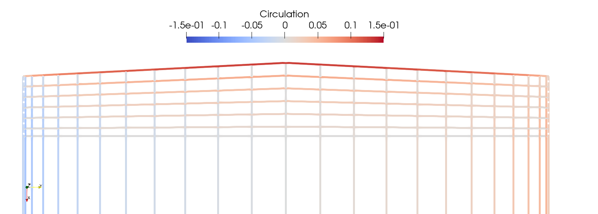

# Guide

This guide demonstrates the basic capabilities of using `VortexLattice`.  First, we need to load the package.

```@example guide
using VortexLattice
nothing #hide
```

Then we need to create our geometry.  While `VortexLattice` can handle multiple lifting surfaces, for this guide we will be analyzing a planar wing with the following geometric properties.

```@example guide
xle = [0.0, 0.4] # leading edge x-position
yle = [0.0, 7.5] # leading edge y-position
zle = [0.0, 0.0] # leading edge z-position
chord = [2.2, 1.8] # chord length
theta = [2.0*pi/180, 2.0*pi/180] # twist (in radians)
phi = [0.0, 0.0] # section rotation about the x-axis
nothing #hide
```

Note that we are only defining half the wing since the wing is symmetric about the X-Z plane.

We also need to define the number of panels and the discretization scheme in the spanwise and chordwise directions.  There are currently three discretization
scheme options: `Uniform()`, `Sine()`, and `Cosine()`.  To maximize the accuracy of our analysis we would like to use cosine spacing in the spanwise direction.  To do this, we need to use sine spacing on the right half of the wing (since once reflected across the y-z plane, sine spacing become cosine spacing).  

```@example guide
ns = 12 # number of spanwise panels
nc = 6  # number of chordwise panels
spacing_s = Sine() # spanwise discretization scheme
spacing_c = Uniform() # chordwise discretization scheme
nothing #hide
```

We generate our lifting surface using `wing_to_surface_panels`.  We can also generate our lifting surface from a pre-existing grid using `grid_to_surface_panels`.

```@example guide
surface = wing_to_surface_panels(xle, yle, zle, chord, theta, phi, ns, nc;
spacing_s=spacing_s, spacing_c=spacing_c, mirror=true)
nothing #hide
```

Note that we used the keyword argument `mirror` to create a copy of our geometry, reflected across the X-Z plane.

Now that we have generated our geometry we need to define our reference parameters and freestream properties. We use the following reference parameters

```@example guide
Sref = 30.0 # reference area
cref = 2.0  # reference chord
bref = 15.0 # reference span
rref = [0.50, 0.0, 0.0] # reference location for rotations/moments (typically the c.g.)
ref = Reference(Sref, cref, bref, rref)
nothing #hide
```

We use the following flow conditions
```@example guide
alpha = 1.0*pi/180 # angle of attack
beta = 0.0 # sideslip angle
Omega = [0.0, 0.0, 0.0] # rotational velocity around the reference location
fs = Freestream(alpha, beta, Omega)
nothing #hide
```

Since the flow conditions are symmetric, we could have modeled only one half of our wing and used symmetry to model the other half.  This, however, would give incorrect results for the lateral stability derivatives so we have instead mirrored our geometry across the X-Z plane.

```@example guide
symmetric = false
nothing #hide
```

We are now ready to perform a steady state analysis. We do so by calling the `steady_analysis` function. This function:
 - Finds the circulation distribution for a given set of panels and flow conditions
 - Performs a near-field analysis to find the forces on each panel, unless
   otherwise specified through the keyword argument `near_field_analysis`
 - Determines the derivatives of the near-field analysis forces with respect to
   the freestream variables, unless otherwise specified through the keyword
   argument `derivatives`

```@example guide
system = steady_analysis(surface, ref, fs; symmetric = symmetric)
nothing #hide
```

The result of our analysis is an object of type `system` which holds the system state.  Note that the keyword argument `symmetric` is required, because it must
be reused in later analyses.

Once we have performed our steady state analysis (and associated near field analysis) we can extract the body force/moment coefficients using the function `body_forces`. These forces are returned in the reference frame specified by the keyword argument `frame`, which defaults to the body reference frame.

Note that a near field analysis must have been performed on `system` for this function to return sensible results.

```@example guide
CF, CM = body_forces(system, surface, ref, fs; symmetric=symmetric, frame=Wind())

# extract aerodynamic forces
CD, CY, CL = CF
Cl, Cm, Cn = CM
nothing #hide
```

We can also extract the forces on the panels on each surface using the `panel_properties` function.

```
properties = panel_properties(system)
nothing #hide
```

Numerical noise often corrupts drag estimates from near-field analyses, therefore, it is often more accurate to compute drag in the farfield on the Trefftz plane.

```@example guide
CDiff = far_field_drag(system, surface, ref, fs; symmetric = symmetric)
nothing #hide
```

We can also compute body or stability derivatives for the aircraft.

```@example guide
dCFb, dCMb = body_derivatives(system, surface, ref, fs; symmetric = symmetric)

# traditional names for each body derivative
CXu, CYu, CZu = dCFb.u
CXv, CYv, CZv = dCFb.v
CXw, CYw, CZw = dCFb.w
CXp, CYp, CZp = dCFb.p
CXq, CYq, CZq = dCFb.q
CXr, CYr, CZr = dCFb.r
Clu, Cmu, Cnu = dCMb.u
Clv, Cmv, Cnv = dCMb.v
Clw, Cmw, Cnw = dCMb.w
Clp, Cmp, Cnp = dCMb.p
Clq, Cmq, Cnq = dCMb.q
Clr, Cmr, Cnr = dCMb.r

nothing #hide
```

```@example guide
dCFs, dCMs = stability_derivatives(system, surface, ref, fs; symmetric = symmetric)

# traditional names for each stability derivative
CDa, CYa, CLa = dCFs.alpha
Cla, Cma, Cna = dCMs.alpha
CDb, CYb, CLb = dCFs.beta
Clb, Cmb, Cnb = dCMs.beta
CDp, CYp, CLp = dCFs.p
Clp, Cmp, Cnp = dCMs.p
CDq, CYq, CLq = dCFs.q
Clq, Cmq, Cnq = dCMs.q
CDr, CYr, CLr = dCFs.r
Clr, Cmr, Cnr = dCMs.r

nothing #hide
```

Visualizing the geometry (and results) may be done in Paraview after writing the associated visualization files using `write_vtk`.

```julia
write_vtk("simplewing", surface, properties[1])
```



For visualization purposes, positive circulation is defined in the +i and +j directions.
